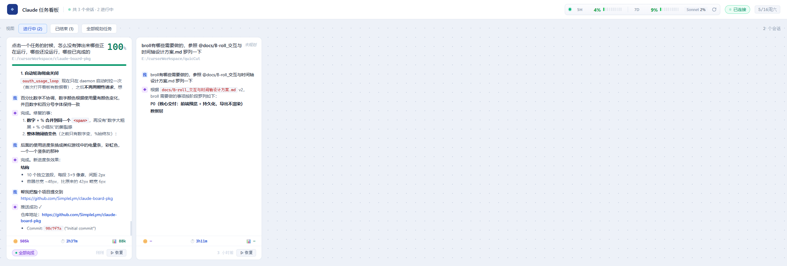
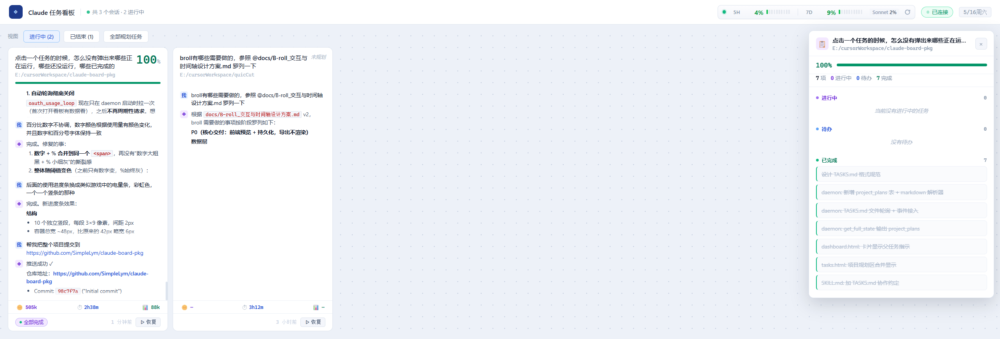
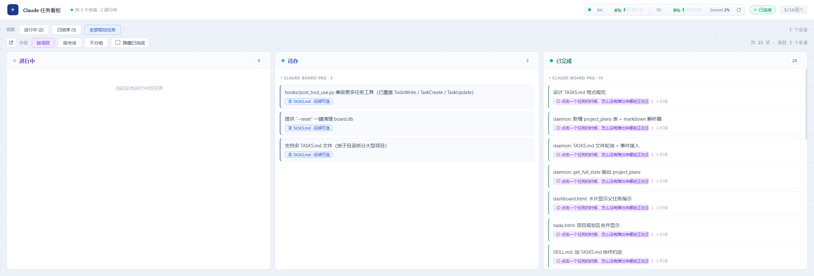

# Claude Board

[简体中文](./README.md) · **English**

A local, real-time web dashboard that aggregates **task plans**, **conversation history**, and **project-level TASKS.md plans** from every Claude Code session on your machine into a single browser page.

No more digging through terminals to remember "what was I planning in that other session?", and no more losing track of long-running tasks across sessions.

  

---

## The problem it solves

Running 3–5 Claude Code terminals in parallel on different projects is common. The pain points:

- **No overview** — you can't see what each session is doing or how far each plan has progressed
- **Cross-session amnesia** — work you started today is forgotten when you open a fresh terminal tomorrow
- **Scattered plans** — sometimes it's Claude's transient `TodoWrite` breakdown, sometimes it's a long-term plan written into a document, and the two don't line up

claude-board unifies all of this:

| Source | How it shows up on the board |
|---|---|
| Every Claude Code session's conversation | Card-internal "Me / ◈" message stream with markdown rendering |
| Transient `TodoWrite` / `TaskCreate` plans | Purple "Plan N/M" badge in the card footer; click to open side panel |
| Project root `TASKS.md` (persistent plan) | **Merged into the same 3-column kanban** as session tasks, marked with a blue "📋 TASKS.md" badge |
| Yesterday's unfinished work | Yellow collapsible banner at the top of the main board, auto-expanded on the first visit of the day |

---

## Screenshots

**Main dashboard** `http://localhost:7820/` — one card per Claude Code session, with conversation timeline, token / duration / context stats, and plan progress.



**Click the purple "Plan N/M" badge → a floating plan panel slides in on the right**, showing three columns (in progress / todo / done). Can be collapsed to a vertical strip.



**All planned tasks aggregate** `http://localhost:7820/tasks` — 3-column kanban that merges TodoWrite tasks from all sessions with TASKS.md project plans. Groupable by project or session. The header carries a game-style "battery bar" showing official `5h / 7d` quota usage.



---

## Install

### 1. Dependencies

Just one:

```bash
pip install -r requirements.txt
# only installs aiohttp
```

Requires Python ≥ 3.10.

### 2. One-time setup

Copies daemon + hooks to `~/.claude-board/` and registers Claude Code hooks globally (`~/.claude/settings.json`):

```powershell
python /path/to/claude-board-pkg/setup.py
```

Add `--project` to scope hooks to the current repo only (writes to `.claude/settings.local.json`):

```powershell
python /path/to/claude-board-pkg/setup.py --project
```

This registers four hooks:

| Hook | Fires on | Purpose |
|---|---|---|
| `SessionStart` | New session begins | Register to daemon, scan TASKS.md |
| `UserPromptSubmit` | Every user prompt | Push the message + auto-derive title |
| `PostToolUse` | TodoWrite / TaskCreate / TaskUpdate / Edit / Write | Sync task state; trigger plan rescan on TASKS.md edits |
| `Stop` | Claude finishes a turn | Capture the latest assistant reply, push to board |

> After editing the source, **re-run setup.py** to sync new files into `~/.claude-board/`. Existing hook configuration is merged, not replaced.

---

## Start it

In a separate terminal, **keep it running**:

```powershell
python "$env:USERPROFILE\.claude-board\daemon.py"
```

Or run the project copy directly (handy during development):

```powershell
python /path/to/claude-board-pkg/daemon.py
```

You should see this banner:

```
  Claude Board
    Dashboard  ->  http://localhost:7820
    Events     ->  POST /api/event
    State      ->  GET  /api/state
    DB         ->  C:\Users\xxx\.claude-board\board.db
```

Open **<http://localhost:7820/>** in a browser. Any Claude Code session you launch afterward will report automatically.

### Port conflict

```powershell
$env:CLAUDE_BOARD_PORT="9000"; python /path/to/claude-board-pkg/daemon.py
```

---

## Core features

### 1. Main dashboard (`/`)

- **Card grid** — one card per session, light tech-style theme
- **Session timeline** — most recent 8 messages in each card; click any message → full-text popup with markdown rendering
- **"Now doing" bar** — purple bar at the top of a card showing **that session's currently in-progress task** (decoupled from project-level 🔄)
- **Floating plan panel** — click the purple "Plan N/M" badge → slides in from the right, three sections (in progress / todo / done); collapsible
- **Yesterday's unfinished banner** — yellow collapsible bar at the top listing every pending/in-progress task from before today, grouped by project; click a task to jump to its plan panel; auto-expands on the first visit each day
- **Active / Ended view toggle** — toolbar switch; sessions that emit `session_stop` move to "Ended"
- **Real-time refresh** — WebSocket-driven, signature-diff rendering, **no flicker**

### 2. All planned tasks aggregate (`/tasks`)

- Three columns: **In Progress / Todo / Done**
- **Session tasks (purple badge) and TASKS.md project plans (blue badge) merged in the same view**
- Grouping: by project / by session / no grouping
- "Hide completed" toggle
- Click any session badge to copy `claude --resume <id>`; click a TASKS.md badge to copy the file path

### 3. TASKS.md — project-level persistent plan ⭐

By convention, `TASKS.md` in a project root holds that project's cross-session long-term plan:

```markdown
## Phase 1: infrastructure
- [ ] Design the API
- [ ] 🔄 Implement the core module      ← inline 🔄 means a session is working on it
- [x] Write unit tests                  ← x = completed
  - [x] sub-task: mock data             ← indent = parent/child
```

**How the daemon syncs**:

- 3-second mtime polling — re-parsed on change
- Combined with the PostToolUse hook: Claude editing TASKS.md via the Edit tool **triggers `plan_scan` immediately**, sub-second feedback
- The parser skips ` ``` ` fenced code blocks (so examples aren't picked up as real tasks)

**Collaboration convention** (defined in `SKILL.md` section 8):

| When | Action |
|---|---|
| Starting an item | Use Edit to add `🔄` after the `[ ]` |
| Finishing an item | Use Edit to flip `[ ]` → `[x]` and remove the `🔄` |
| Does the daemon auto-write the file? | **No** — only Claude can edit it, so every write is visible in the chat and reviewable |

---

## Project layout

```
claude-board-pkg/
├── daemon.py              HTTP + WebSocket server (aiohttp)
├── dashboard.html         main board single-page app
├── tasks.html             /tasks aggregate page
├── setup.py               one-time install: copy files + register hooks
├── requirements.txt       aiohttp
├── SKILL.md               Claude Code Skill definition (incl. TASKS.md convention)
├── TASKS.md               this project's own plan, doubles as a format example
├── README.md              中文文档
├── README.en.md           this file
└── hooks/
    ├── session_start.py        SessionStart hook
    ├── user_prompt_submit.py   UserPromptSubmit hook
    ├── post_tool_use.py        PostToolUse hook (TodoWrite / TaskCreate / Edit / ...)
    └── stop.py                 Stop hook
```

State storage → `~/.claude-board/board.db` (SQLite + WAL).

---

## HTTP / WebSocket API

| Path | Method | Purpose |
|---|---|---|
| `/` | GET | Main dashboard HTML |
| `/tasks` | GET | All planned tasks aggregate HTML |
| `/api/state` | GET | Full state snapshot (JSON) |
| `/api/event` | POST | Event ingestion from hooks / external tools |
| `/ws` | WS | Dashboard subscribes to real-time updates |

**Event types** (POST `/api/event`):

- `session_init` — register/update session info
- `session_title` / `session_title_default` — set title
- `session_stop` — mark session ended
- `message` — push one message (role: user/assistant)
- `task_sync` — replace the entire task list for a session (TodoWrite)
- `task_upsert` — add/update a single task (TaskCreate/TaskUpdate)
- `task_delete` — delete one session task
- `plan_scan` — force re-scan of a project's TASKS.md
- `plan_delete` — delete one TASKS.md line
- `session_delete` — delete an entire session (with its rounds and tasks)
- `session_usage` — submit token usage totals for a session
- `usage_refresh` — pull Anthropic's official usage quota

---

## Upgrade / reset

**After editing the source**:

```powershell
python /path/to/claude-board-pkg/setup.py    # sync new files
# Ctrl+C the old daemon, then restart
python /path/to/claude-board-pkg/daemon.py
```

**Wipe the database** (does not touch code or hook config):

```powershell
Remove-Item "$env:USERPROFILE\.claude-board\board.db*"
```

**Remove hooks**: manually delete the entries under `hooks.SessionStart/UserPromptSubmit/PostToolUse/Stop` in `~/.claude/settings.json` whose `command` starts with `~/.claude-board/hooks/`.

---

## Known limitations

- On Windows, stdin defaults to cp936; hooks explicitly decode as UTF-8 (fixed). Linux/macOS unaffected.
- Hook matcher changes in `settings.json` are **not hot-reloaded** by the current Claude Code session — new matchers only apply to Claude Code terminals started **after** running setup.py.
- `TaskCreate`'s `tool_response` field shape isn't verified across versions; the hook falls back to a content MD5 as task_id, which may cause a later `TaskUpdate` to miss and show as two separate tasks. Will tune once observed in real usage.
- The Anthropic `/api/oauth/usage` endpoint is an internal Claude Code API — undocumented and could change with any Claude Code update. The dashboard automatically falls back to local-transcript estimation if it stops working.

---

## License

MIT
